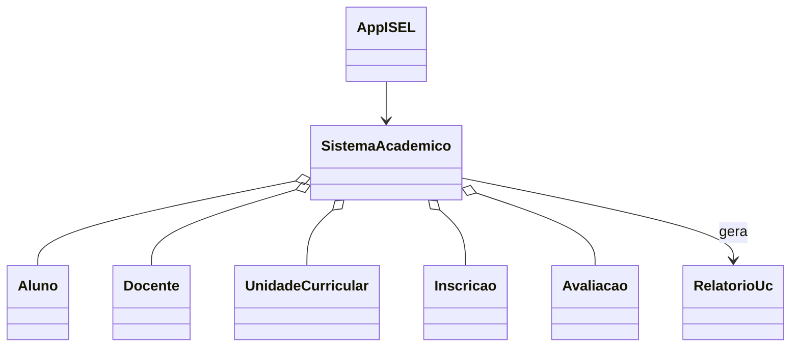

# Architecture (tp1.isel)

## Visao geral

O package `tp1.isel` implementa um sistema academico de consola. A interface de utilizador esta em `AppISEL`, que delega a logica em `SistemaAcademico`. Os dados sao guardados em memoria, usando listas simples.

## Componentes

- `AppISEL` - Ponto de entrada e menu interativo.
- `SistemaAcademico` - Logica de negocio e validacoes.
- Entidades: `Aluno`, `Docente`, `UnidadeCurricular`, `Inscricao`, `Avaliacao`, `RelatorioUc`.

## Fluxo principal

1. `AppISEL` le input do utilizador.
2. `AppISEL` chama metodos em `SistemaAcademico`.
3. `SistemaAcademico` valida regras e atualiza listas.
4. Resultados sao devolvidos para a consola.

## Regras e validacoes

- Nao permite duplicados por id (numero do aluno, id do docente, codigo da UC).
- Email e validado de forma simples (`@` e `.`).
- Ano do aluno tem de estar entre 1 e 3.
- Inscricao so e aceite se o aluno estiver registado e houver capacidade na UC.
- Avaliacoes sao rejeitadas se a soma dos pesos exceder 100 ou se nota/peso estiver fora de intervalo.

## Limites

- Sem persistencia.
- Sem testes automatizados.
- Interface apenas de consola.
